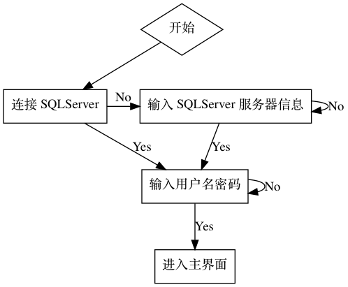

[toc]
# mitcpro
## 整体设计
整个系统分为三层：用户界面层，后台逻辑层，数据层。

用户界面层负责窗体的绘制、用户的交互、数据的展示。

后台逻辑层负责本项目的主体功能，根据功能划分为不同模块。每个模块开放若干接口，便于上层（用户界面层）和本层其他模块进行调用。每个模块根据功能会向下连接数据库，并对数据库进行增删改查等操作。

数据层主要为 SQLServer 数据库，需要根据系统功能设计若干张表，用于保存系统的关键数据和方便用户查询。

第一层和第二层部分全部使用 C# 编写，体现为多个类。其中界面类是本系统的主程序，它拥有后台逻辑层各类的实例，当用户在界面进行某些操作后，通过这些实例调用对应的接口完成功能。

## 用户界面层

### 总体流程图
进入主界面前的流程如图所示：

进入主界面后，根据用户的角色跳转到指定界面，并确定该用户可以访问的界面。

界面用选项卡分成五个部分，分别是：订单管理、库存管理、生产流程管理、系统管理、帮助。

### 角色和界面的关系

【**要和甲方确认有哪些角色，每个角色都有什么权限**】
暂定角色有：系统管理员，仓库管理员，订单管理员，生产计划员，操作员[N]。

系统管理员默认进入系统管理界面，ta 可以访问所有界面。

仓库管理员默认进入库存管理界面，ta 可以访问『库存管理』和『帮助』下的界面。

订单管理员默认进入订单管理界面，ta 可以访问『订单管理』和『帮助』下的界面。

生产计划员默认进入生产流程管理界面下的生产计划计划子界面，ta 可以访问『生产流程管理』下的『生产计划』界面和『帮助』界面。

操作员[N]默认进入生产流程管理界面下的其对应工序的生产子界面，ta 可以访问『生产流程管理』下的『XX』界面和『帮助』界面。

### XXX 界面详细设计
【**所有细节需要确认**】

## 后台逻辑层

### 用户管理

#### 功能简述

#### 接口列表

### 生产流程

### 库存管理

### 系统管理

### 订单管理

## 数据层

